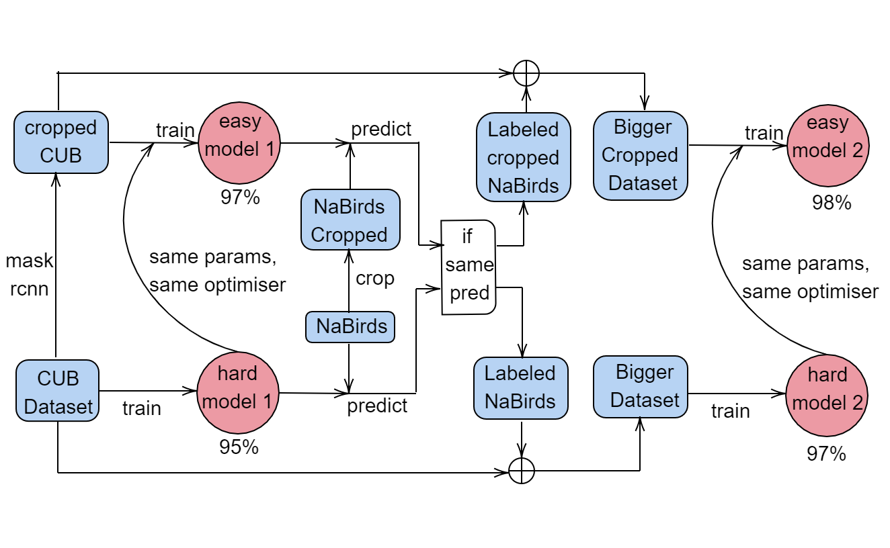

## Object recognition and computer vision 2020/2021

### Assignment 3: Image classification 

At https://github.com/MSoumm/RecVis-A3-2020-2021

### Algorithm
We use a 2 stage algorithm, with self-supervised learning:

1. First stage:
    - Crop the images on the birds using Mask R-CNN (``` detect``` function in ```detector.py```)
    - Generate a Vision Transformer model, unfreeze last 3 blocks, regenerate head, and add a classification layer (```model.py```)
    - Train for 10 epochs on non cropped images (_hard model_)
    - Continue training for 10 epochs on cropped images, keeping the weights and optimiser (_easy model_)
2. Prediction:
    - Download the NaBirds Dataset, keep only the 20 classes if our dataset, put all of them in a single folder (```make_self_supervised``` in ```preprocess.py```)
    - Crop the images using bounding boxes provided with NaBirds dataset
    - Predict classes for NaBirds (```evaluate_unlabeled.py```) :
        - Predict on the non cropped images with the _hard model_
        - Predict on the cropped images with the _easy model_
        - If predictions are the same, label the image with this prediction
3. Second stage:
    - Use the new labeled images for training.
    - Same training strategy as first stage.
        
#### Usage
1. Install PyTorch from http://pytorch.org
2. Run the following command to install additional dependencies
    ```bash
    pip install -r requirements.txt
    ```

3. Download the dataset from [here](https://www.di.ens.fr/willow/teaching/recvis18orig/assignment3/bird_dataset.zip)

4. Run the following command to train the model
    ```
    python main.py  --data [D] --self-supervised [SS] --batch-size [B] 
                    --epochs [N] --experiment [E] --log-interval [L] --seed [S]
                    
        options:
            --data [D] : folder where data is located (default 'bird_dataset')
            --self-supervised [SS] : whether to use self-supervised data augmentation (default: True)
            --batch-size [B] : input batch size for training (default: 16)
            --epochs [N] : number of epochs to train (default: 10)
            --experiment [E] : folder where experiment outputs are located (default 'experiment')
            --log-interval [L] : how many batches to wait before logging training status (default: 10)
            --seed [S] : random seed (default: 1) 
    ```
5. Evaluating the model:
    Several checkpoints are made during training:
        - `easy_vit_model_X.pth` and `hard_vit_model_X.pth` for first stage models.
        - `final_easy_vit_model_X.pth` and `final_hard_vit_model_X.pth` for second stage models.
    
    To evaluate run the following command:
    ```bash
    python evaluate.py --data [data_dir] --easy-vit-model [model_file] --hard-vit-model [model_file]
                       --outfile [file] --create-east-hard [C]
        options:
            --data [D] : folder where data is located (default 'bird_dataset')
            --easy-vit-model [model_file] : easy model to use
            --hard-vit-model [model_file] : hard model to use
            --outfile [file] : name of the outfile (default 'kaggle.csv')
            --create-east-hard [C] :  Whether to split test data into cropped/non cropped images (default True)                 
    ```
    
